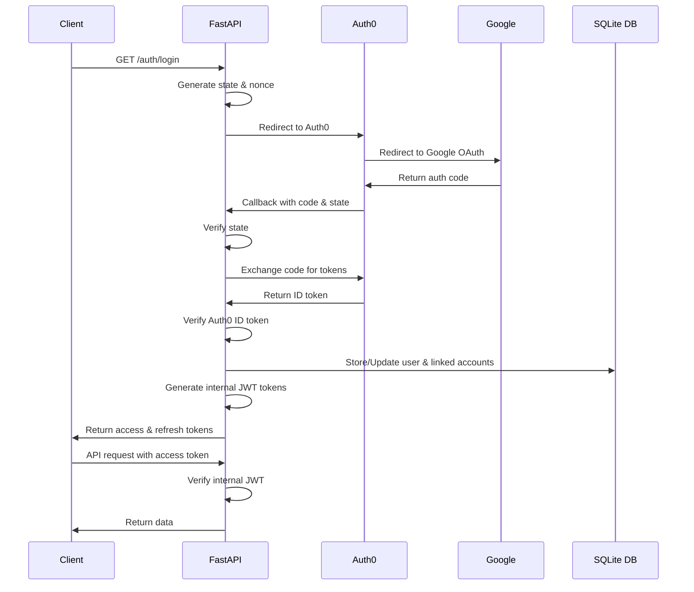

# Auth0 JWT Google Authentication

FastAPIを使用した認証システムです。Auth0を通じたGoogle OAuth2認証を実装し、内部で独自のJWTトークンを発行・管理します。データベースを使用してユーザー情報と連携アカウント情報を永続化します。

## 🏗 アーキテクチャ

本プロジェクトは **ドメイン駆動設計（DDD）** の原則に基づいて構築されています。

### ディレクトリ構成

```
.
├── contexts/                   # 境界づけられたコンテキスト
│   └── users/                  # ユーザー管理コンテキスト
│       ├── domain/             # ドメイン層
│       │   ├── entities.py     # Userエンティティ
│       │   ├── interfaces.py   # リポジトリインターフェース
│       │   └── exceptions.py   # ドメイン例外
│       ├── application/        # アプリケーション層
│       │   ├── services.py     # 認証サービス（ユースケース）
│       │   ├── dependencies.py # FastAPI依存性注入
│       │   └── exceptions.py   # アプリケーション例外
│       ├── infrastructure/     # インフラストラクチャ層
│       │   ├── auth0_client.py # Auth0統合
│       │   ├── database.py     # データベースセッション管理
│       │   ├── models.py       # SQLAlchemyモデル
│       │   └── repositories.py # リポジトリ実装
│       └── presentation/       # プレゼンテーション層
│           └── router.py       # APIエンドポイント
├── core/                       # 共通コア機能
│   ├── config.py               # 設定管理（pydantic-settings）
│   └── security.py             # JWT処理
├── schemas/                    # Pydanticスキーマ
│   └── auth.py                 # 認証関連のDTO
├── alembic/                    # データベースマイグレーション
│   ├── env.py                  # Alembic環境設定
│   ├── script.py.mako          # マイグレーションテンプレート
│   └── versions/               # マイグレーションファイル
├── main.py                     # アプリケーションエントリポイント
├── alembic.ini                 # Alembic設定ファイル
├── requirements.txt            # Pythonパッケージ依存関係
├── .env.example               # 環境変数サンプル
├── .dockerignore              # Dockerビルド除外設定
├── Dockerfile                  # Dockerコンテナ設定
├── compose.yml                 # Docker Compose設定
├── login_flow.md              # ログインフロー詳細説明
└── README.md                  # このファイル
```

### レイヤーアーキテクチャ

#### 1. **ドメイン層** (`contexts/users/domain/`)
- ビジネスロジックの中核
- `User`エンティティ：ユーザー情報を表現するドメインモデル
- `LinkedAccount`エンティティ：外部プロバイダ連携アカウント情報
- `IAuthClient`インターフェース：認証クライアントの抽象化
- `IUserRepository`インターフェース：ユーザーデータアクセスの抽象化
- ドメイン例外：認証エラー、トークン検証エラー、ユーザー管理エラーなど

#### 2. **アプリケーション層** (`contexts/users/application/`)
- ユースケースの実装
- `AuthenticationService`：認証フローのオーケストレーション
- 依存性注入定義：FastAPIとの統合
- アプリケーション例外：トークン処理エラーなど

#### 3. **インフラストラクチャ層** (`contexts/users/infrastructure/`)
- 外部サービス・データベースとの統合
- `Auth0Client`：Auth0 OAuth2フローとJWT検証（Authlib使用）
- SQLAlchemyモデル：`UserModel`、`LinkedAccountModel`テーブル定義
- `UserRepository`実装：データベースを使用したユーザー永続化
- データベースセッション管理：SQLAlchemyセッション制御

#### 4. **プレゼンテーション層** (`contexts/users/presentation/`)
- REST APIエンドポイント
- リクエスト/レスポンスの処理
- FastAPIルーター定義
- OpenAPI仕様の定義

## 🔐 認証フロー



### トークン管理

- **アクセストークン**: 短期間有効（設定可能、デフォルト15分）
- **リフレッシュトークン**: 長期間有効（設定可能、デフォルト7日）
- **自動リフレッシュ**: `/auth/refresh`エンドポイントでトークン更新

## 🚀 セットアップ

### Docker Composeを使用したセットアップ

#### 1. 環境変数の設定

`.env.example`をコピーして`.env`を作成：

```bash
cp .env.example .env
```

必要に応じて値を編集：

```env
# アプリケーション設定
APP_URL=http://localhost:8000

# Auth0設定
AUTH0_DOMAIN=your-domain.auth0.com
AUTH0_CLIENT_ID=your-client-id
AUTH0_CLIENT_SECRET=your-client-secret
AUTH0_AUDIENCE=your-audience

# データベース設定
DATABASE_URL=your-database-url

# アクセストークン設定
ACCESS_TOKEN_SECRET_KEY=your-access-token-secret-key-change-in-production
ACCESS_TOKEN_EXPIRATION_MINUTES=15

# リフレッシュトークン設定
REFRESH_TOKEN_SECRET_KEY=your-refresh-token-secret-key-change-in-production
REFRESH_TOKEN_EXPIRATION_DAYS=7

# セッションミドルウェア設定
SESSION_SECRET_KEY=your-session-secret-key-change-in-production

# ログアウト設定
LOGOUT_RETURN_URL=http://localhost:8000

# デバッグ設定
DEBUG=true
```

#### 2. Docker Composeでアプリケーションを起動

```bash
# バックグラウンドで起動
docker compose up -d
```

#### 3. データベースのセットアップ

初回起動時はAlembicマイグレーションを実行してテーブルを作成する必要があります：

```bash
# データベースマイグレーションを実行
docker compose exec app alembic upgrade head
```

#### 4. アプリケーションへアクセス

- APIドキュメント: http://localhost:8000/docs

#### 5. アプリケーションの停止

```bash
docker compose down
```

## 📚 API エンドポイント

### 認証エンドポイント

| メソッド | パス | 説明 | 認証 |
|---------|------|------|------|
| GET | `/auth/login` | ログインフロー開始（Auth0へリダイレクト） | 不要 |
| GET | `/auth/callback` | Auth0コールバック処理とトークン発行 | 不要 |
| POST | `/auth/refresh` | リフレッシュトークンを使用したトークン更新 | 不要 |
| GET | `/auth/logout` | ログアウトURL取得 | 不要 |

### その他のエンドポイント

| メソッド | パス | 説明 |
|---------|------|------|
| GET | `/docs` | Swagger UIドキュメント |
| GET | `/openapi.json` | OpenAPIスキーマ |

### レスポンス例

#### `/auth/callback` - 認証成功
```json
{
  "access_token": "eyJ...",
  "refresh_token": "eyJ...",
  "token_type": "Bearer",
  "expires_in": 900,
  "message": "認証に成功しました。APIリクエストにはaccess_tokenをBearerトークンとして使用してください。"
}
```

#### `/auth/refresh` - トークンリフレッシュ成功
```json
{
  "access_token": "eyJ...",
  "refresh_token": "eyJ...",
  "token_type": "Bearer",
  "expires_in": 900,
  "message": "トークンが正常に更新されました"
}
```

#### `/auth/logout` - ログアウトURL取得
```json
{
  "message": "ログアウトを完了するには、認証プロバイダにリダイレクトしてください",
  "logout_url": "https://your-domain.auth0.com/v2/logout?returnTo=http://localhost:8000&client_id=your-client-id"
}
```

## 🔧 技術スタック

- **Web Framework**: FastAPI >=0.115.12
- **ASGI Server**: Uvicorn[standard] >=0.34.2
- **Database ORM**: SQLAlchemy >=2.0.0
- **Database Migration**: Alembic >=1.13.0
- **Authentication**: Auth0 + Google OAuth2 (Authlib 1.6.3)
- **Token Management**: JWT (PyJWT 2.10.1)
- **HTTP Client**: httpx >=0.28.1
- **Validation**: Pydantic >=2.11.4
- **Configuration**: pydantic-settings >=2.9.1
- **Session Management**: Starlette SessionMiddleware (itsdangerous 2.2.0)
- **Containerization**: Docker + Docker Compose

## 🛡️ セキュリティ機能

- **CSRF対策**: OAuth2 stateパラメータによるCSRF攻撃防止
- **Nonce検証**: リプレイ攻撃防止のためのnonce検証
- **JWT署名検証**: RS256/HS256アルゴリズムによるトークン署名検証
- **トークン有効期限**: アクセストークン（短期）とリフレッシュトークン（長期）の分離
- **セキュアなセッション管理**: HTTPOnlyクッキーによるセッション管理

## 📝 注意事項

- プロダクション環境では必ず`.env`ファイルのシークレットキーを変更してください
- データベースURLは環境に応じて適切に設定してください（SQLite、PostgreSQL、MySQL等）
- Auth0の設定でコールバックURLとログアウトURLを正しく設定する必要があります
