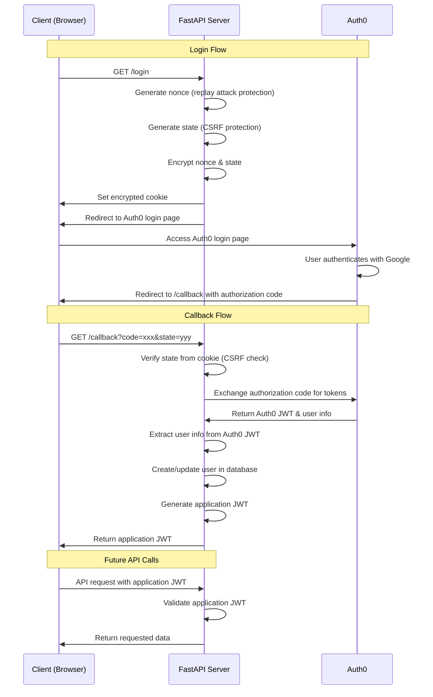

# 認証フロー

## Google OAuth と Auth0 の統合

## 主要なセキュリティ機能

- **Nonce（ノンス）**: 各認証リクエストを一意にすることで、リプレイ攻撃を防止します
- **State（ステート）**: コールバックが元のリクエストと一致することを検証し、CSRF攻撃を防止します
- **Cookie暗号化**: 認証フロー中のnonceとstateの値を保護します
- **アプリケーションJWT**: Auth0のJWT形式からアプリを切り離し、将来的に認証プロバイダーを変更する際の柔軟性を提供します

## なぜAuth0のJWTではなくアプリケーションJWTを使用するのか？

1. **プロバイダー非依存性**: Auth0から他のプロバイダーに切り替えたり、追加の認証プロバイダーを導入する場合でも、クライアント側の変更が不要です
2. **カスタムクレーム**: Auth0の構造に依存せず、アプリケーション固有のクレームを追加できます
3. **トークン有効期限の制御**: 独自のトークン有効期限ポリシーを管理できます
4. **クライアントロジックの簡素化**: 認証方法に関係なく、クライアントは1つのJWT形式のみを理解すれば良くなります